Proyecto 2 – Análisis Forense Digital

CSIRT – Adquisición Inicial

Autor – Asier González

---

## 1. Introducción

El presente documento recoge el proceso de **adquisición, recolección, documentación y preservación de evidencias digitales** correspondiente al incidente detectado en una máquina del departamento de IT.

La actuación se ha realizado siguiendo la **metodología forense propia** de la organización, basada en:

- ISO/IEC 27037 (Guía para identificación, recolección y preservación de evidencias).
- RFC 3227 (Orden de volatilidad y principios de adquisición).
- UNE 71506:2013 (Metodología para el análisis forense de evidencias electrónicas).
- Metodología interna: Adquisición → Preservación → Documentación → Presentación.

El objetivo de esta fase es obtener evidencia íntegra, verificable y trazable sin alterar el estado del sistema comprometido.

---

## 2. Metodología aplicada

Durante la adquisición se aplicaron los siguientes principios:

1. **Orden de volatilidad**: primero recolección en vivo (procesos, red, sesiones), después memoria RAM y por último disco.
2. **No ejecución de herramientas externas dentro de la máquina comprometida** para preservar la integridad.
3. **Recolección nativa con herramientas del sistema operativo** (CMD, WMIC, `schtasks`, visor de eventos).
4. **Adquisición de RAM desde el hipervisor VirtualBox**, evitando alteración del sistema.
5. **Clonado forense del disco desde el host** mediante FTK Imager.
6. **Verificación de integridad mediante hashes SHA256**.
7. **Cadena de custodia documentada** indicando responsables, fechas y ubicación.

Estas medidas garantizan una recolección adecuada y defendible en términos legales y técnicos.

---

## 2.1. Inventario de evidencias adquiridas

| ID | Evidencia | Tipo | Origen | Ubicación forense |
| --- | --- | --- | --- | --- |
| E01 | RAM_PROYECTO_2.elf | Memoria | VM (hipervisor) | `C:\\Evidencias\\RAM\\RAM_PROYECTO_2.elf` |
| E02 | disk.001 (+ disk.002, disk.003, …) | Disco RAW | Archivo VDI de la VM | `C:\\Evidencias\\DISCO\\disk.001`, `disk.002`, … |
| E03 | 01_systeminfo.txt | Triage | CMD nativo | `C:\\DFIR\\live\\01_systeminfo.txt` |
| E04 | 05_netstat_ano.txt | Triage red | CMD nativo | `C:\\DFIR\\live\\05_netstat_ano.txt` |
| E05 | Application.evtx / System.evtx / Security.evtx | Logs | Visor de eventos | `C:\\DFIR\\export\\logs\\` |
| E06 | HoVgcPUXNBk.vbs | Script sospechoso | `C:\\Windows\\Temp` | `C:\\DFIR\\export\\malware\\HoVgcPUXNBk.vbs` |

---

## 3. Estado inicial de la máquina comprometida

Al iniciar sesión en la máquina virtual con el usuario Administrador se observó:

- Mensaje emergente de error relacionado con un script VBScript ubicado en `C:\\Windows\\Temp\\*.vbs`.
- Solicitud de reinicio del sistema.
- Diálogo emergente para configurar la ubicación de red.

Estos elementos fueron documentados sin interactuar con la configuración para evitar contaminación de la evidencia.

[CAPTURA 01 – Estado inicial del escritorio con errores del sistema]
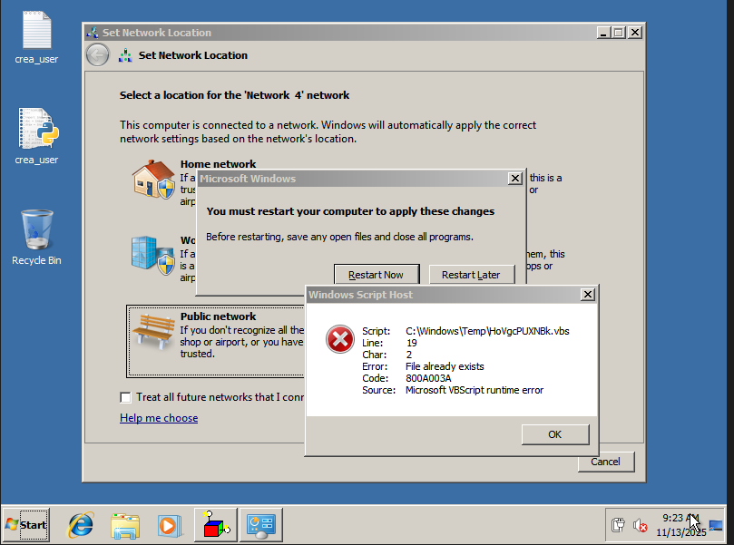

---

## 4. Recolección de evidencias (triaje)

La recolección de evidencias volátiles se complementó con un **triaje inicial del sistema**, generando múltiples ficheros `.txt` (procesos, red, servicios, tareas programadas) que permiten una primera valoración rápida del compromiso.

Se preparó un entorno de trabajo:

```
C:\\DFIR\\
C:\\DFIR\\live\\
C:\\DFIR\\export\\
```

[CAPTURA 02 – Carpeta DFIR creada en el sistema]
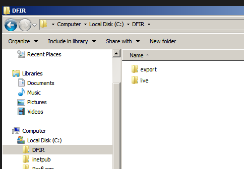
La adquisición se realizó completamente con comandos nativos del sistema.

---

### 4.1. Información del sistema

Se capturó información general de hardware y software mediante:

```bash
systeminfo > C:\DFIR\live\01_systeminfo.txt
```

---

### 4.2. Información de red

Comandos ejecutados:

```bash
ipconfig /all  > C:\DFIR\live\02_ipconfig_all.txt
route print    > C:\DFIR\live\03_route_print.txt
arp -a         > C:\DFIR\live\04_arp.txt
netstat -ano   > C:\DFIR\live\05_netstat_ano.txt
```

Estos ficheros recogen la configuración de red, las rutas, la tabla ARP y las conexiones activas, útiles para identificar actividad sospechosa y posibles conexiones del atacante.

---

### 4.3. Procesos activos

```bash
tasklist /v             > C:\DFIR\live\06_tasklist_v.txt
wmic process list full  > C:\DFIR\live\07_wmic_process_full.txt
```

Esta información permite identificar procesos anómalos, posibles inyecciones y aplicaciones que podrían estar relacionadas con el incidente.

---

### 4.4. Servicios y persistencia

```bash
wmic service get name,displayname,state,startmode > C:\DFIR\live\08_services.txt
schtasks /query /fo LIST /v                      > C:\DFIR\live\09_schtasks.txt
```

Estos resultados son relevantes para detectar mecanismos de persistencia (servicios automáticos, tareas programadas sospechosas, etc.).

---

### 4.5. Sesiones y variables de entorno

```bash
query user > C:\DFIR\live\10_logged_users.txt
set        > C:\DFIR\live\11_env_vars.txt
```

La información de usuarios conectados y variables de entorno aporta contexto adicional sobre el entorno de ejecución.

---

### 4.6. Carpeta DFIR tras la adquisición en vivo

[CAPTURA 03 – Contenido de `C:\DFIR\live` con todos los ficheros .txt generados]
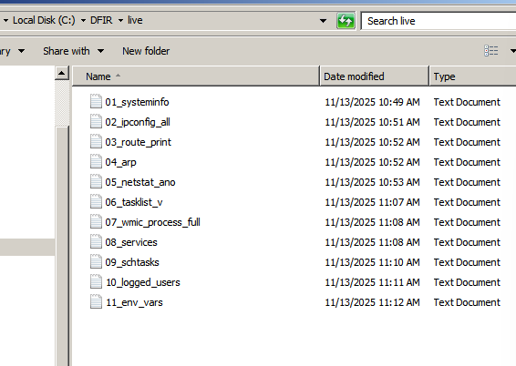
---

## 5. Exportación de logs del sistema

Desde el Visor de eventos de Windows se exportaron los siguientes registros:

- `Application.evtx`
- `System.evtx`
- `Security.evtx`

Guardados en:

```
C:\DFIR\export\logs\
```

[CAPTURA 04 – Exportación de logs desde Event Viewer y carpeta destino con los .evtx]
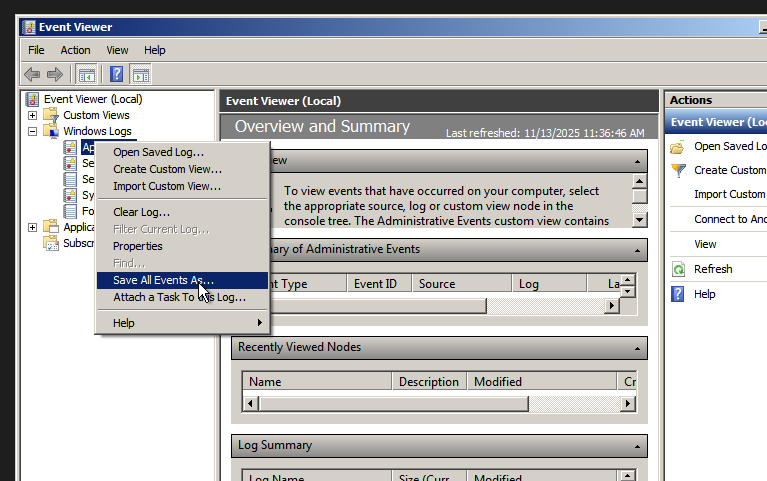
Estos logs son esenciales para reconstruir el timeline del incidente (eventos de inicio de sesión, creación de procesos, errores de aplicación, cambios de configuración, etc.).

---

## 6. Copia del archivo sospechoso

Se identificó un archivo anómalo ejecutado automáticamente:

```
C:\Windows\Temp\HoVgcPUXNBk.vbs
```

Este archivo se copió a la zona de trabajo forense:

```
C:\DFIR\export\malware\
```

[CAPTURA 05 – HoVgcPUXNBk.vbs en `C:\Windows\Temp` – HoVgcPUXNBk.vbs copiado a `C:\DFIR\export\malware`]
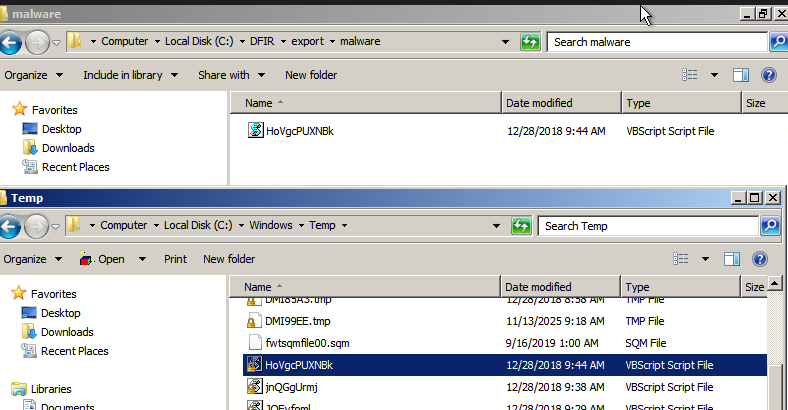

Este script será objeto de análisis detallado en fases posteriores para determinar su funcionalidad y relación con el compromiso.

---

## 7. Aislamiento de la máquina

Para evitar alteración remota adicional, la máquina virtual fue aislada desde el hipervisor:

- VirtualBox → Configuración → Red → desmarcar “Cable conectado”.

[CAPTURA 07 – Configuración de red en VirtualBox mostrando el cable desconectado]
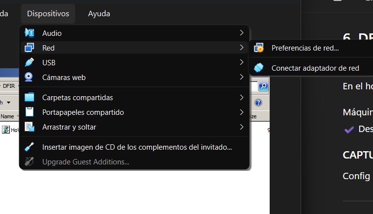

Esta acción garantiza que, tras la fase de triaje, el sistema no continúa comunicándose con posibles servidores de mando y control (C2).

---

## 8. Adquisición de memoria RAM

Con la VM encendida, se realizó un volcado completo de memoria desde el hipervisor, sin ejecutar software adicional dentro del sistema comprometido:

```bash
VBoxManage debugvm "FORENSIC_10" dumpvmcore --filename "C:\Evidencias\RAM_PROYECTO_2.elf"
```

[CAPTURA 08 – Ejecución del comando `dumpvmcore` en el host]
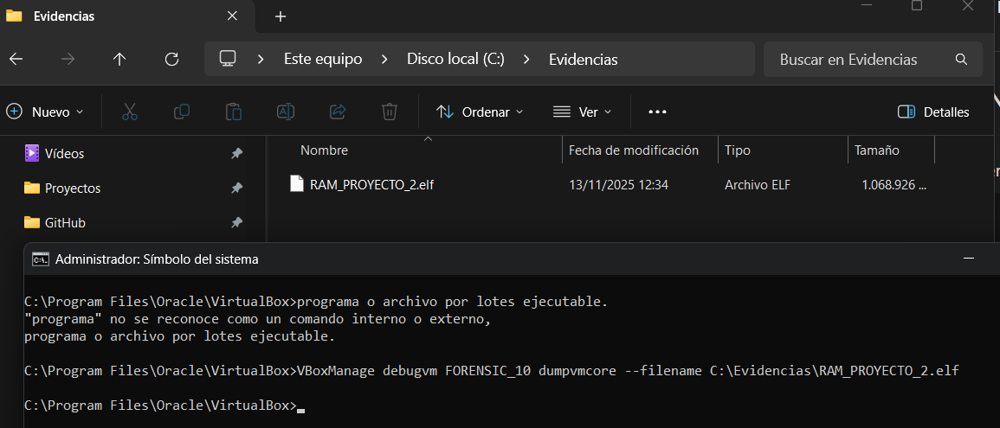

[CAPTURA 09 – Archivo `RAM_PROYECTO_2.elf` generado en `C:\Evidencias\RAM`]
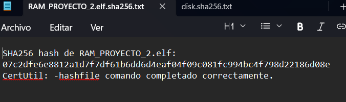
Esta evidencia permitirá posteriormente realizar análisis de memoria (procesos, módulos, conexiones, artefactos en RAM).

---

## 9. Adquisición del disco

Con la máquina apagada (Power Off), se utilizó FTK Imager en el host para generar una copia forense RAW del archivo `.vdi` de la VM.

La imagen resultante fue segmentada en archivos:

```
disk.001
disk.002
disk.003
...
```

[CAPTURA 10 – FTK Imager mostrando el archivo .vdi cargado como evidencia]
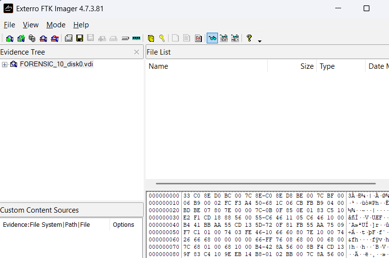

[CAPTURA 11 – Proceso de creación de la imagen RAW en FTK Imager]
[ftk_create_image.png](images/ftk_create_image.png)
[CAPTURA 12 – Carpeta final con `disk.001`, `disk.002`, etc.]
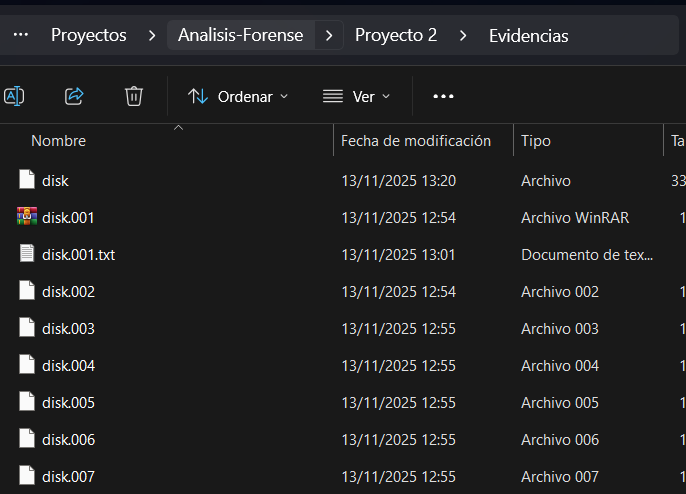

El archivo principal es `disk.001`, que contiene el encabezado de la imagen RAW segmentada.

---

## 10. Verificación de integridad (hashes SHA256)

### 10.1. Memoria RAM

Se calculó el hash SHA256 del volcado de memoria:

```bash
certutil -hashfile RAM_PROYECTO_2.elf SHA256 > RAM_PROYECTO_2.elf.sha256.txt
```

[CAPTURA 13 – Salida del cálculo de hash SHA256 de `RAM_PROYECTO_2.elf`]

El valor SHA256 obtenido se consignará en la tabla de cadena de custodia.

---

### 10.2. Imagen de disco

Se calculó el hash SHA256 del primer segmento de la imagen RAW:

```bash
certutil -hashfile disk.001 SHA256 > disk.001.sha256.txt
```

[CAPTURA 14 – Salida del cálculo de hash SHA256 de `disk.001`]
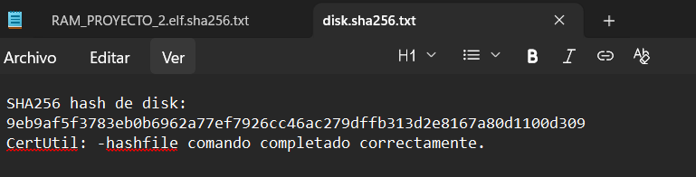
Este hash permite verificar la integridad del segmento principal de la imagen forense del disco.

---

### 10.3. Archivo sospechoso (.vbs)

Se calculó también el hash SHA256 del archivo sospechoso:

```bash
certutil -hashfile HoVgcPUXNBk.vbs SHA256 > HoVgcPUXNBk.vbs.sha256.txt
```

[CAPTURA 15 – Salida del cálculo de hash SHA256 del archivo `HoVgcPUXNBk.vbs`]
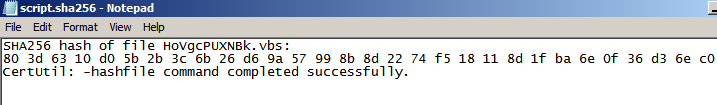
El hash de este archivo será útil para correlacionarlo con bases de datos de malware o indicadores de compromiso.

---

## 11. Cadena de custodia

La siguiente tabla resume la cadena de custodia de las evidencias principales:

| Evidencia | Origen | Fecha/Hora | Responsable | Hash (SHA256) | Ubicación |
| --- | --- | --- | --- | --- | --- |
| RAM_PROYECTO_2.elf | Dumpeado desde hipervisor | 13/11/25 [hh:mm] | Asier | SHA256: [valor SHA256 RAM_PROYECTO_2.elf] | `C:\Evidencias\RAM` |
| disk.001 | Imagen RAW del VDI | 13/11/25 [hh:mm] | Asier | SHA256: [valor SHA256 disk.001] | `C:\Evidencias\DISCO` |
| Archivos TXT volátiles | Recolección nativa | 13/11/25 [hh:mm] | Asier | No aplica (conjunto de ficheros de triaje) | `C:\DFIR\live` |
| Logs EVTX | Exportados desde visor | 13/11/25 [hh:mm] | Asier | No aplica (conjunto de logs) | `C:\DFIR\export\logs` |
| Script HoVgcPUXNBk.vbs | `C:\Windows\Temp` | 13/11/25 [hh:mm] | Asier | SHA256: [valor SHA256 HoVgcPUXNBk.vbs] | `C:\DFIR\export\malware` |

Nota: Los valores `[valor SHA256 …]` deben completarse con los hashes reales obtenidos en los comandos anteriores.

---

## 12. Estructura final de almacenamiento

La evidencia se organizó en el host en la siguiente estructura:

```
Proyecto2_Evidencias/
   live/
   export/
   RAM/
   DISCO/
   capturas/
   cadena_custodia.pdf
```

Esta organización facilita el acceso controlado y la trazabilidad de cada tipo de evidencia.

---

## 13. Conclusión

La adquisición de la máquina comprometida se completó con éxito siguiendo la metodología forense establecida y respetando el orden de volatilidad. Se obtuvieron:

- Todos los artefactos volátiles disponibles mediante herramientas nativas del sistema.
- Un volcado íntegro de memoria RAM desde el hipervisor.
- Una imagen RAW del disco segmentada y verificable.
- Hashes SHA256 de las evidencias críticas para garantizar su integridad.
- Una cadena de custodia completa que recoge responsables, fechas, hashes y ubicaciones.

La evidencia queda preparada para su análisis en la siguiente fase del proyecto, en la que se determinarán el CVE explotado, el proceso malicioso implicado y las herramientas utilizadas por el atacante.